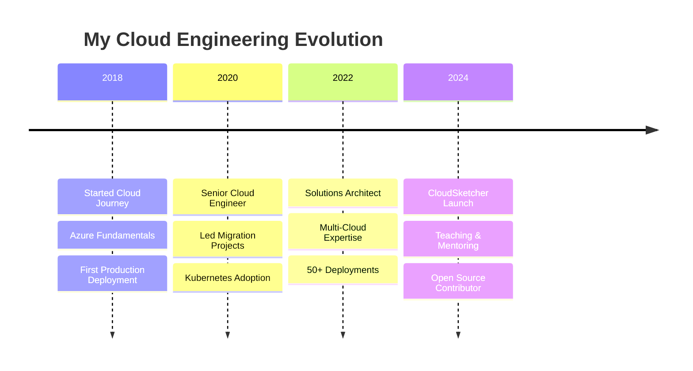

<div align="center">
  
  <!-- Navigation Bar -->
  <div>
    <a href="#about"></a>&nbsp;&nbsp;
    <a href="#cloudsketcher"></a>&nbsp;&nbsp;
    <a href="#experience"></a>&nbsp;&nbsp;
    <a href="#skills"></a>&nbsp;&nbsp;
    <a href="#projects"></a>&nbsp;&nbsp;
    <a href="#contact"></a>
  </div>
  
  <br/>
  
  <!-- Hero Section -->
  
  
  <p>
    
  </p>
  
  <!-- CTA Buttons -->
  <p>
    <a href="https://www.cloudsketcher.com/$web/index.html">
      
    </a>&nbsp;
    <a href="https://www.linkedin.com/in/amoghavarsh-p">
      
    </a>
  </p>
  
  
  
</div>

<br/>

<!-- About Section -->
<div id="about">
  
## 👨‍💻 About Me


Welcome! I'm a **Cloud Solutions Architect** and **Full-Stack Developer** based in Bangalore, India 🇮🇳

With over **6 years** of experience in cloud engineering, I specialize in designing and implementing scalable, cloud-native solutions across Azure, AWS, and GCP. My passion lies in simplifying complex cloud architectures and making them accessible to everyone.

🎯 **Current Mission:** Building [CloudSketcher](https://www.cloudsketcher.com), a revolutionary tool that transforms how engineers visualize and design multi-cloud architectures.

📚 **Philosophy:** "Simplicity is the ultimate sophistication" - I believe in creating tools that make complex cloud concepts accessible and visual.

🌟 **Impact:** 50+ production deployments | 10+ enterprise cloud migrations | 1000+ engineers helped

<br clear="right"/>

</div>

<br/>

<!-- CloudSketcher Feature Section -->
<div id="cloudsketcher">
  
## 🚀 Featured Project: CloudSketcher

<div align="center">
  <table>
    <tr>
      <td width="50%">
        <h3 align="center">🎨 What is CloudSketcher?</h3>
        <p align="center">
          A powerful web application that revolutionizes cloud architecture design with intuitive drag-and-drop functionality across Azure, AWS, and GCP.
        </p>
        <br/>
        <div align="center">
          <a href="https://www.cloudsketcher.com/$web/index.html">
            
          </a>
        </div>
      </td>
      <td width="50%">
        <div align="center">
          
          
          
          
        </div>
        <br/>
        
```javascript
const features = {
  "🖱️": "Drag & Drop Interface",
  "🔄": "Cross-Cloud Conversion", 
  "🤖": "AI-Powered Diagrams",
  "📤": "Export SVG/PNG",
  "🔗": "Shareable Links",
  "🎨": "Beautiful Designs"
};
```
      </td>
    </tr>
  </table>
</div>

</div>

<br/>

<!-- Experience Timeline -->
<div id="experience">
  
## 💼 Professional Journey

<div align="center">



</div>

### 🏆 Key Achievements

<div align="center">
  <table>
    <tr>
      <td align="center" width="33%">
        <h3>50+</h3>
        <p>Production Deployments</p>
      </td>
      <td align="center" width="33%">
        <h3>10+</h3>
        <p>Enterprise Migrations</p>
      </td>
      <td align="center" width="33%">
        <h3>1000+</h3>
        <p>Engineers Mentored</p>
      </td>
    </tr>
  </table>
</div>

</div>

<br/>

<!-- Skills Section -->
<div id="skills">
  
## 🛠️ Technical Expertise

<div align="center">

| Category | Technologies |
|----------|-------------|
| **☁️ Cloud Platforms** |    |
| **🐳 Containerization** |    |
| **🔧 IaC & Automation** |    |
| **💻 Development** |    |
| **📊 Monitoring** |    |

</div>

### 📈 GitHub Stats

<div align="center">
  
  
</div>

</div>

<br/>

<!-- Projects Grid -->
<div id="projects">
  
## 📂 Open Source Projects

<div align="center">
  <table>
    <tr>
      <td width="50%">
        <h3 align="center">🔧 Terraform Modules</h3>
        <div align="center">
          <p>Production-ready IaC modules for Azure/AWS</p>
          
          
        </div>
      </td>
      <td width="50%">
        <h3 align="center">📦 AKS Patterns</h3>
        <div align="center">
          <p>Best practices and deployment patterns for AKS</p>
          
          
        </div>
      </td>
    </tr>
    <tr>
      <td width="50%">
        <h3 align="center">🚀 CI/CD Templates</h3>
        <div align="center">
          <p>GitHub Actions & Azure DevOps pipelines</p>
          
          
        </div>
      </td>
      <td width="50%">
        <h3 align="center">📚 Cloud Tutorials</h3>
        <div align="center">
          <p>Step-by-step guides and documentation</p>
          
          
        </div>
      </td>
    </tr>
  </table>
</div>

</div>

<br/>

<!-- Services Section -->
<div id="services">
  
## 🎯 How I Can Help You

<div align="center">
  <table>
    <tr>
      <td align="center" width="25%">
        
        <br/><br/>
        <b>Cloud Consulting</b>
        <p>Architecture design & optimization</p>
      </td>
      <td align="center" width="25%">
        
        <br/><br/>
        <b>Mentoring</b>
        <p>Interview prep & career guidance</p>
      </td>
      <td align="center" width="25%">
        
        <br/><br/>
        <b>Training</b>
        <p>Workshops & hands-on labs</p>
      </td>
      <td align="center" width="25%">
        
        <br/><br/>
        <b>Speaking</b>
        <p>Tech talks & conferences</p>
      </td>
    </tr>
  </table>
</div>

</div>

<br/>

<!-- Contact Section -->
<div id="contact">
  
## 📫 Let's Connect

<div align="center">
  
  <h3>Ready to collaborate on your next cloud project?</h3>
  
  <p>
    <a href="mailto:your.email@example.com">
      
    </a>&nbsp;
    <a href="https://www.linkedin.com/in/amoghavarsh-p">
      
    </a>&nbsp;
    <a href="https://www.youtube.com/@Amoghavarsh">
      
    </a>
  </p>
  
  <br/>
  
  
  
  <br/><br/>
  
  <p>
    
    
    
  </p>
  
  <br/>
  
  <i>⭐ If you find my work helpful, please consider giving a star to my repositories!</i>
  
  <br/><br/>
  
  <sub>© 2024 Amoghavarsh P. • Built with ☁️ and ☕ from Bangalore</sub>
  
</div>

</div>
