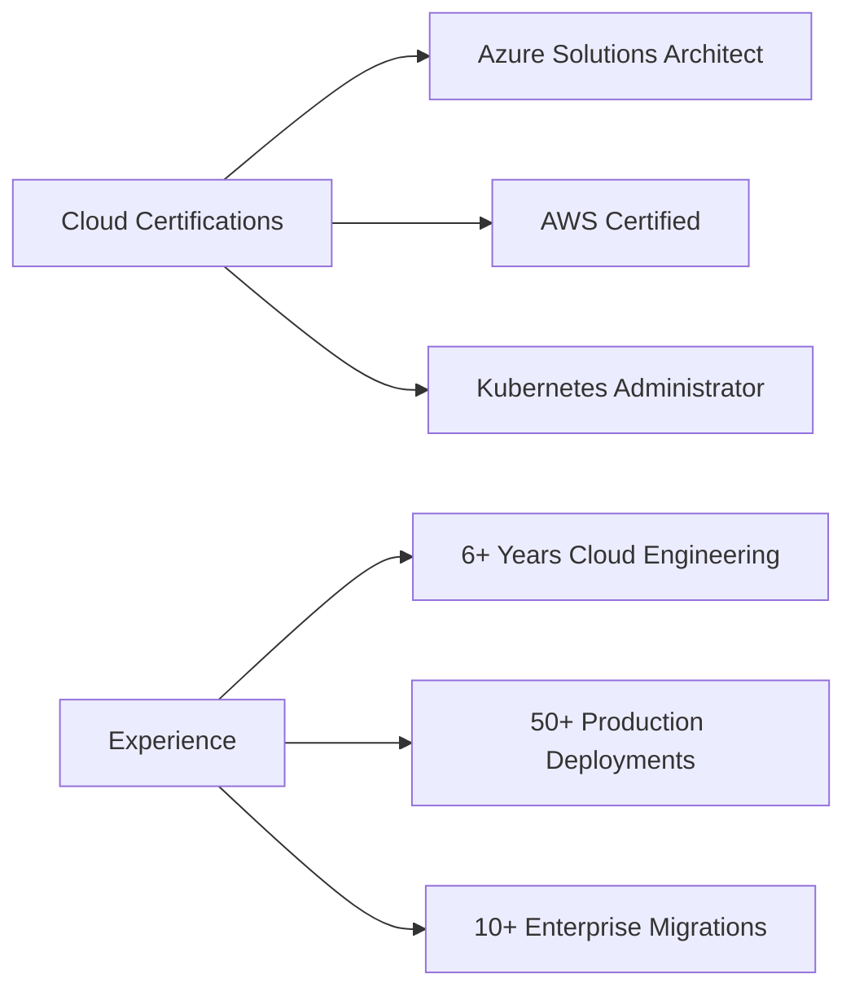

<div align="center">
  
</div>

<div align="center">
  
</div>

<div align="center">
  
[](https://www.cloudsketcher.com/$web/index.html)
[](https://www.linkedin.com/in/amoghavarsh-p)
[](https://www.youtube.com/@Amoghavarsh)


</div>

---

## 🎯 Mission Statement


```python
class CloudArchitect:
    def __init__(self):
        self.name = "Amoghavarsh P."
        self.role = "Cloud Engineer & Solutions Architect"
        self.location = "Bangalore, India 🇮🇳"
        self.experience = "6+ years"
        self.current_focus = "CloudSketcher"
        self.mission = "Simplifying cloud architecture visualization"
    
    def skills(self):
        return {
            "clouds": ["Azure", "AWS", "GCP"],
            "orchestration": ["Kubernetes"],
            "iac": ["Terraform"],
            "languages": ["Python"],
            "expertise": ["Cloud Native", "DevOps", "Automation"]
        }
    
    def say_hi(self):
        print("Let's build something amazing in the cloud! ☁️")

me = CloudArchitect()
me.say_hi()
```

---

## 🚀 CloudSketcher - My Flagship Project

<div align="center">
  <a href="https://www.cloudsketcher.com/$web/index.html">
    
  </a>
</div>

<table>
<tr>
<td width="60%">

### ✨ What is CloudSketcher?

A revolutionary web tool that transforms how engineers visualize and design cloud architectures across **Azure**, **AWS**, and **GCP**.

### 🎯 Key Features

- 🖱️ **Drag & Drop Interface** - Intuitive cloud service placement
- 🔄 **Cross-Cloud Conversion** - Seamlessly translate between Azure/AWS/GCP
- 📤 **Smart Export** - SVG/PNG with shareable links
- 🤖 **AI-Powered** - Generate diagrams from text descriptions
- 🎨 **Beautiful Visuals** - Professional-grade architecture diagrams

</td>
<td width="40%">


</td>
</tr>
</table>

<div align="center">
  <a href="https://www.cloudsketcher.com">
    
  </a>
</div>

---

## 💻 Tech Arsenal

<div align="center">

### ☁️ Cloud Platforms & Infrastructure


### 🐳 Containers & Orchestration


### 🔧 Infrastructure as Code


### 📊 Monitoring & DevOps


### 💡 Languages & Frameworks


</div>

---

## 📊 GitHub Analytics

<div align="center">
  
  
</div>

<div align="center">
  
</div>

---

## 🏆 Achievements & Certifications

<div align="center">



</div>

---

## 🎓 Knowledge Sharing

<table>
<tr>
<td width="50%">

### 📺 YouTube Content
- **Azure Tutorials** - Step-by-step guides
- **IaC Best Practices** - Terraform/Bicep patterns
- **Cloud Architecture** - Design patterns & anti-patterns
- **AKS Deep Dives** - Production tips & tricks

</td>
<td width="50%">

### 🎯 Mentorship & Interview Prep
- **Cloud Interview Preparation** - System design for cloud
- **IaC Code Reviews** - Best practices & optimization
- **Architecture Reviews** - Scalability & cost optimization
- **Career Guidance** - Cloud engineering path

</td>
</tr>
</table>

---

## 🚀 Current Focus & Future Plans

<div align="center">

| 🔍 Currently Working On | 🎯 Learning | 🚀 Next Goals |
|:-----------------------:|:----------:|:-------------:|
| CloudSketcher v2.0 | FinOps & Cost Optimization | Multi-cloud governance platform |
| AI-powered architecture suggestions | Platform Engineering | Cloud security automation |
| Real-time collaboration features | Service Mesh (Istio) | Technical blog & courses |

</div>

---

## 🤝 Let's Collaborate!

<div align="center">

### I'm open to:

🔸 **Cloud Architecture Consulting** • 🔸 **Open Source Contributions**  
🔸 **Speaking at Tech Events** • 🔸 **Mentoring Engineers**  
🔸 **Building Developer Tools** • 🔸 **Technical Writing**

</div>

---

## 📬 Connect With Me

<div align="center">
  
[](mailto:your.email@example.com)
[](https://www.linkedin.com/in/amoghavarsh-p)
[](https://www.cloudsketcher.com)
[](https://www.youtube.com/@Amoghavarsh)

</div>

---

## 💡 Daily Dev Quote

<div align="center">


</div>

---

<div align="center">
  
### ⭐ Support My Work

If you find CloudSketcher or my content helpful, please consider:

[](https://github.com/amoghavarsh)
[](https://github.com/amoghavarsh/cloudsketcher)

**Your support helps me create more tools for the community!**

</div>

---

<div align="center">
  
  
  <sub>Built with ☁️ and lots of ☕ from Bangalore, India</sub>
  
</div>
